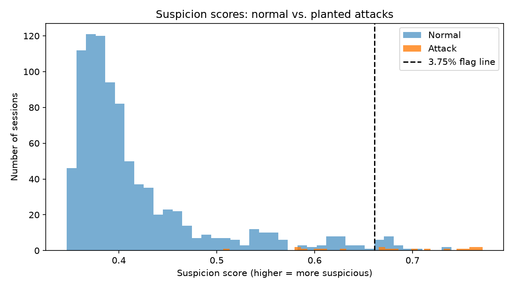

# Digital Behavioral Baseline

When someone steals a password, the login looks legitimate. This project looks at **behavior** instead. It learns what's normal for each user (when they log in, from where, on what device, how fast they work, and which pages they use) and flags sessions that don't fit. A triage step then ranks the flagged sessions and explains each one in plain language for an analyst.

Built in Python on synthetic company logs with planted attacks, so every result can be checked against a known answer key.

## Results at a glance

At a review budget of 3.75% of sessions (about 35 sessions over two weeks):

- **Caught 13 of 20 planted attacks** (recall 65%, ROC-AUC 0.976)
- **Every caught attack landed in HIGH priority** after triage, so an analyst working the HIGH list finds all 13 within 18 reviews
- **Cleared 11 false alarms** from employees returning from leave, using a triage rule based on login pace
- **All 7 missed attacks were "quiet" attackers** moving at human speed, which is the main limit of this approach

## How it works

| Step | Script | What it does |
|---|---|---|
| 1 | `src/generate_logs.py` | Creates 50 users with roles and realistic habits, 44 days of activity, and planted attacks in the last 14 days. Saves the answer key separately. |
| 2 | `src/feature_engineering.py` | Turns raw log rows into one row of 13 measurements per session, many compared to that user's own history. |
| 3 | `src/train_and_score.py` | Trains an Isolation Forest on normal sessions only, scores every test session, and flags the top 3.75%. |
| 4 | `src/triage.py` | Adds evidence tags and a HIGH / MEDIUM / LOW priority to each flagged session, and writes the analyst queue. |
| 5 | `src/evaluate.py` | Opens the answer key and reports what was caught, missed, and falsely flagged. |

### The core idea

The model never sees an attack during training. It learns what **normal** looks like, then flags what **doesn't fit**. This matters because real attacks are rare and keep changing, so you can't count on having examples of them. The trade-off is that the model finds **unusual, not bad**. Deciding which unusual sessions are dangerous is the job of the triage step and the analyst.

### Time windows

- **History (training days 1–20):** used only to learn each user's normal
- **Fit (training days 21–30):** normal sessions the model trains on
- **Test (14 days):** sessions the model scores

Fit and test sessions are both compared to the History window. A session can't be part of its own baseline, or its city, device, and pages would never look new.

### Features (one row per session)

| Group | Features |
|---|---|
| Speed | average seconds between actions; speed compared to this user's usual pace; busiest single minute |
| Volume | number of actions; share of actions that are downloads |
| Logins | failed logins; password changed; average seconds between failed logins |
| Pages | share of visits to sensitive pages; share of pages this user has never visited |
| Context | hours from this user's usual login time; new city for this user; new device for this user |

### Attack types planted

| Type | Loud version | Quiet version |
|---|---|---|
| **Explorer** | Slow, wanders, half its visits on sensitive pages | Victim's own pages at the victim's pace, a few sensitive stops |
| **Bot** | Very fast mass download | Downloads at a human pace |
| **Guesser** | A burst of rapid failed logins, then a password change | (none) |

Each attack also gets a 50% chance each of an odd login hour, a new location, and a new device, so some attacks show none of these clues.

### Realistic normal behavior

Normal users aren't perfectly tidy, because real employees aren't:

- **Roles:** finance, managers, and IT use sensitive pages as part of their jobs
- **Quick exports:** finance staff sometimes go straight to export and pull files fast
- **Returning from leave:** a few failed logins at human pace, then a password change
- **Hybrid workers:** two normal locations and devices
- **Remote switchers:** two users change city, device, and hours partway through the test period
- **Occasional users:** a few logins a month at random hours
- **Everyday noise:** password typos, travel, new devices

## Key decisions

| Decision | Choice | Reasoning |
|---|---|---|
| Attack rate in test data | 3% target (2.2% actual) | Rare enough that false alarms are a real problem, common enough to measure. Real-world rates are much lower. |
| Review budget | Top 3.75% of sessions | Raising it to 5% caught one more attack but added 11 more false alarms. |
| Users with no history | Send to manual review | No baseline means nothing to compare against, so a person decides. |
| Missing failed-login pace | Fill and cap at 60 seconds | Most sessions have fewer than two failed logins. On this feature, slow means human, so 60 honestly says "no rapid guessing happened." Filling with 0 would make every normal session look like a bot. |
| Forgot-password sessions | Triage rule sets them to LOW | Failed logins at human pace, from the user's own city and device, look like a person who forgot their password. |
| Feature scaling | Not used | Isolation Forest checks one feature at a time, so features on different scales don't affect it. |

## Results

### Version 1 vs. version 2

The first version scored a **perfect ROC-AUC of 1.000** and caught all 25 attacks. I didn't trust it. A perfect score on a security problem usually means the test is too easy. Investigating showed that normal users never visited sensitive pages and every attacker did, so one feature gave the answer away.

Version 2 fixed the data from both sides: normal users became messier (roles, leave returns, remote work) and half the Explorers and Bots became quiet. The score dropped to 0.976, and the model started missing attacks. Those are results worth trusting.

### Flag rate comparison (version 2)

| Flag rate | Flagged | Caught | Missed | False alarms | Precision | Recall |
|---|---|---|---|---|---|---|
| 1% | 10 | 8 | 12 | 2 | 80% | 40% |
| **3.75%** | **35** | **13** | **7** | **22** | **37%** | **65%** |
| 5% | 47 | 14 | 6 | 33 | 30% | 70% |

- **Precision:** of the flagged sessions, the share that were real attacks
- **Recall:** of the real attacks, the share that were caught
- **ROC-AUC:** whether attacks generally scored higher than normal sessions (1.0 is perfect, 0.5 is guessing)

ROC-AUC of 0.976 sounds excellent, but at the actual budget, only about a third of what the model flags is real. What the analyst experiences is the top of the list, so precision and recall at the budget matter more than AUC.

### Caught by attack type (3.75%)

| Attack | Caught |
|---|---|
| Explorer, loud | 6 of 6 |
| Bot, loud | 2 of 2 |
| Guesser | 3 of 3 |
| Bot, quiet | 2 of 5 |
| Explorer, quiet | 0 of 4 |

### Triage

| Priority | Real attacks | Normal sessions | What the normal sessions were |
|---|---|---|---|
| HIGH | 13 | 5 | Finance quick exports |
| MEDIUM | 0 | 6 | Remote switchers, one traveler |
| LOW | 0 | 11 | Employees returning from leave |

### Score distribution



## Limitations

**The data is synthetic.** The results show the method works on data built to test it. They can't show how it would perform on real company logs.

**Designer bias.** I designed the attacks, the normal behavior, and the triage rules. The rules fit the fake data partly because they were written with knowledge of how it was generated. Real triage rules need to be tested on data nobody looked at while writing them.

**It finds unusual, not bad.** It missed all 4 quiet Explorers and 3 of 5 quiet Bots, because they moved at human speed. It also flagged innocent but rare events. Adding a feature that clearly separated forgetful employees from Guessers didn't stop the model from flagging them, because both were rare.

**Normal is learned once.** When a user switched to remote work, the model kept flagging them (8 false alarms from one user). This is concept drift, and the model doesn't adapt to it.

**Thin baselines.** Four users had fewer than 5 sessions of history to define their normal. Their scores are less reliable.

**Untested manual review path.** Every user happened to have at least one session in the History window, so the manual review step never ran in this dataset.

**Small numbers.** There were only 20 attacks in total and 3 Guessers. Results per attack type are examples, not reliable rates.

**The attack rate is higher than reality.** Real compromise rates are far below 2%. At a realistic rate, precision would be lower and false alarms would make up more of the queue.

**The forgot-password rule is a loophole.** Anyone who knows it can hide by failing logins slowly from the victim's own device. That describes an insider or someone with physical access.

**Not modeled:** account lockout, password spraying across many accounts, time zones, and VPNs that make an attacker appear to be in the victim's city.

## Future work

- **Rolling baseline:** relearn each user's normal from recent weeks so the model keeps up with changes like remote work
- **Role-aware triage rules:** stop finance quick exports from landing in HIGH
- **Analyst feedback:** use each "real" or "false alarm" decision to measure which rules work, including whether the LOW rule gets abused
- **Real labeled incidents:** if available, use them to test the model and tune triage, while still training on normal behavior

## Getting started

Requires Python 3.11 or newer.

```
git clone <repo-url>
cd behavioral-baseline
python -m venv venv
venv\Scripts\activate          # Windows
source venv/bin/activate       # Mac/Linux
pip install -r requirements.txt
```

Run the pipeline in order:

```
python src/generate_logs.py
python src/feature_engineering.py
python src/train_and_score.py
python src/triage.py
python src/evaluate.py
```

The random seed is fixed, so every run produces the same data and results.

## Project structure

```
behavioral-baseline/
├── data/
│   ├── raw/          generated logs
│   ├── processed/    session features, scores, triage results
│   └── labels/       answer key (only evaluate.py reads it)
├── models/           saved Isolation Forest
├── reports/          analyst queue, flag-rate comparison, score chart
├── src/              the five pipeline scripts
└── requirements.txt
```

## Tech stack

Python, pandas, NumPy, scikit-learn (Isolation Forest), matplotlib, PyArrow

## License

MIT
